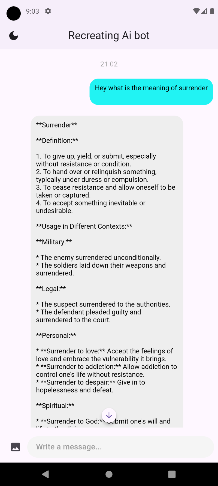
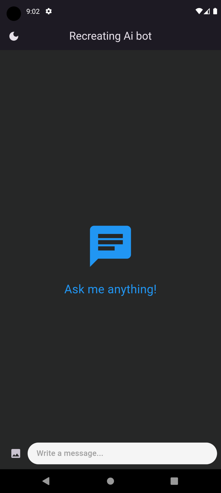

# Chat Bot App

## Overview

The Chat Bot App is a Flutter-based application that utilizes the Gemini API for processing user queries and providing responses. It allows users to type messages or send images whose descriptions they want to know. The app features a user-friendly interface using the Gemini package and includes functionality for both light and dark modes.

## Features

### Messaging
- **Text Messages**: Users can type messages to ask questions or seek information.
- **Image Analysis**: Supports sending images to receive descriptions using image picker functionality.
- **Response Processing**: Utilizes the Gemini API to process user queries and generate responses.

### UI Design
- **DashChat Integration**: Implements DashChat for a modern and intuitive messaging UI experience.
- **Light and Dark Modes**: Supports both light and dark themes for user preference and usability.

## Technologies Used
- **Flutter**: Framework for building the app.
- **Gemini API**: Backend service for natural language processing and response generation.
- **DashChat**: Flutter package for implementing the messaging interface.
- **Image Picker**: Flutter package for selecting and sending images.

